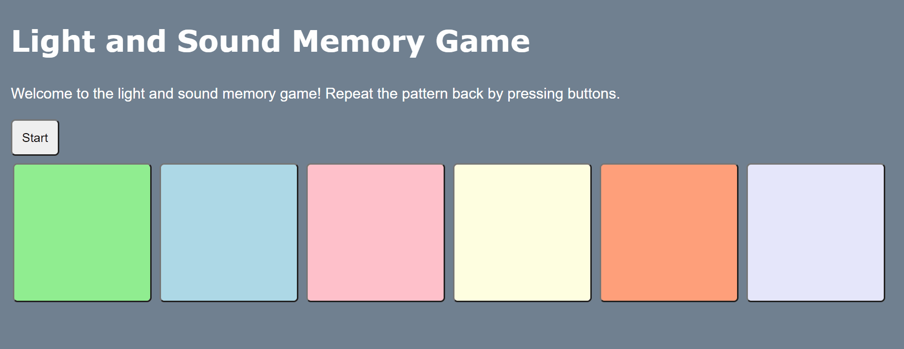

# Pre-work - *Memory Game*

**Memory Game** is a Light & Sound Memory game to apply for CodePath's SITE Program. 

Submitted by: **Michelle Lin**

Time spent: **4** hours spent in total

Link to project: https://equinox-handy-cardamom.glitch.me

## Required Functionality

The following **required** functionality is complete:

* [X] Game interface has a heading (h1 tag), a line of body text (p tag), and four buttons that match the demo app
* [X] "Start" button toggles between "Start" and "Stop" when clicked. 
* [X] Game buttons each light up and play a sound when clicked. 
* [X] Computer plays back sequence of clues including sound and visual cue for each button
* [X] Play progresses to the next turn (the user gets the next step in the pattern) after a correct guess. 
* [X] User wins the game after guessing a complete pattern
* [X] User loses the game after an incorrect guess

The following **optional** features are implemented:

* [X] Any HTML page elements (including game buttons) has been styled differently than in the tutorial
* [X] Buttons use a pitch (frequency) other than the ones in the tutorial
* [X] More than 4 functional game buttons
* [ ] Playback speeds up on each turn
* [ ] Computer picks a different pattern each time the game is played
* [ ] Player only loses after 3 mistakes (instead of on the first mistake)
* [ ] Game button appearance change goes beyond color (e.g. add an image)
* [ ] Game button sound is more complex than a single tone (e.g. an audio file, a chord, a sequence of multiple tones)
* [ ] User has a limited amount of time to enter their guess on each turn

The following **additional** features are implemented:

- [ ] List anything else that you can get done to improve the app!

## Video Walkthrough (GIF)

If you recorded multiple GIFs for all the implemented features, you can add them here:

## Reflection Questions
1. If you used any outside resources to help complete your submission (websites, books, people, etc) list them here. 
I visited https://www.w3schools.com/cssref/css_colors.asp to look for colors for my buttons.

2. What was a challenge you encountered in creating this submission (be specific)? How did you overcome it? (recommended 200 - 400 words) 
A challenge I faced when creating this submission was understanding the Javascript portion. I'm more comfortable with HTML and CSS since I've worked with them before. But Javascript is like unfamiliar territory, especially since I can't immediately see the visual effects of each line of code. Although I have encountered some Javascript in the project's I've worked on, I'm not completely comfortable with it because I haven't learned it at a proficient level. It felt strange to code in a language where I was uncertain about the syntax and attempting to translate the pseudocode in my head into Javascript. I wasn't going to let my nervousness with Javascript stop me from completing the pre-work. When it came to adding Javascript code to the light and sound game, I took the time to carefully read through additional information in the toggles to figure out why that code worked. I went through a process of breaking apart each line of Javascript code to find an equivalent in Python, a language I'm well aquatinted with after taking several classes. For instance, I found parallels between console.log() and print(), function myFunction() and def myFunction(), and more. Finding a Python equivalent based on the detailed information helped me see that Javascript isn't as hard as I thought.

3. What questions about web development do you have after completing your submission? (recommended 100 - 300 words) 
Being a child of the digital age, I've visited a lot of websites in my day-to-day life. A large majority of them are perfectly normal, functional websites. But the ones that catch my attention the most are websites of digital artists, such as https://www.loftgarten.co. Their websites are artsy in nature and the visual component is huge. I'm wondering how they are able to make their website flow so smoothly when the user scrolls down, the freeform looking layout, and the little touches of animation with each click of a button. Is all of this achieved with the same languages we used in the pre-work: HTML, CSS, and Javascript? If yes, I would love to learn more about how they achieved all these effects so I can recreate the same immersive experience I felt scrolling their website when it comes time for me to make a website.

4. If you had a few more hours to work on this project, what would you spend them doing (for example: refactoring certain functions, adding additional features, etc). Be specific. (recommended 100 - 300 words) 
If I had more time to work on the project, I would focus on adding more features that rely on Javascript. I noticed that most of the optional features I implemented are either related to HTML or CSS. I did those because I am knowledgeable enough in HTML and CSS to effectively debug if I  wrote incorrect code for those features. But with more time to play around with the Javascript code, I would implement the random pattern and 3 strikes features. Those require writing Javascript functions, which would be good practice to push me out of my comfort zone. And just for a bit of fun with HTMl and CSS, I'll use the extra time to change the buttons so users can see a meme when they press it.

## Interview Recording URL Link

[My 5-minute Interview Recording](your-link-here)

## License

    Copyright Michelle Lin

    Licensed under the Apache License, Version 2.0 (the "License");
    you may not use this file except in compliance with the License.
    You may obtain a copy of the License at

        http://www.apache.org/licenses/LICENSE-2.0

    Unless required by applicable law or agreed to in writing, software
    distributed under the License is distributed on an "AS IS" BASIS,
    WITHOUT WARRANTIES OR CONDITIONS OF ANY KIND, either express or implied.
    See the License for the specific language governing permissions and
    limitations under the License.